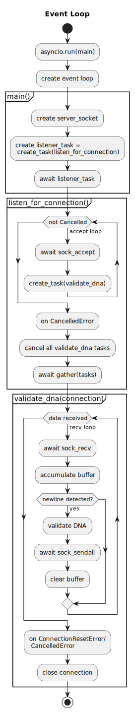

# Server for validation DNA

A script for starting server with asyncio which validate string to DNA by subseting of IUPAC alphabet

## Description

This script starts a server that you can connect to and check the validity of your DNA.

## Getting Started

### Installing

**Copying from github**
```commandline
git clone https://github.com/Seitsan/async_dna_validator.git
```

### Executing program

```commandline
python main.py
```

## Event Loop


## Authors


Denis Kolodin ('Seitsan')

## License

This project is licensed under the MIT License - see the LICENSE file for details
